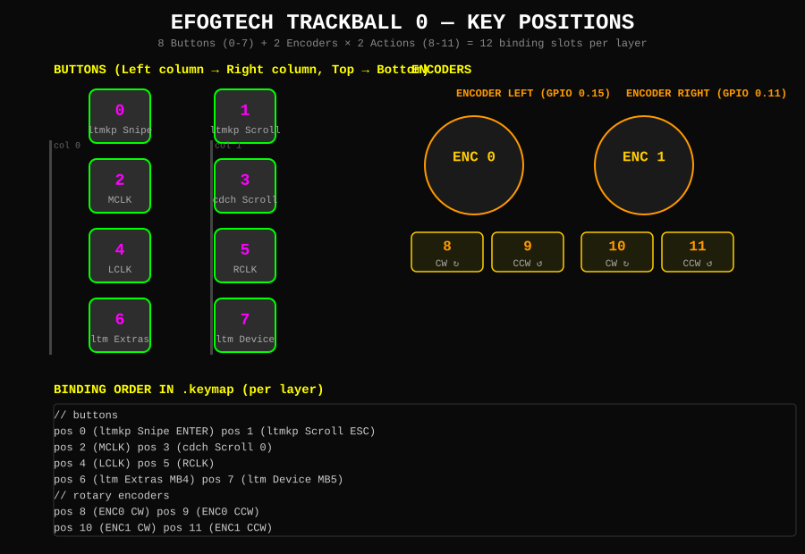
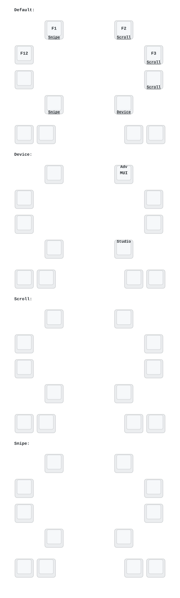

# Endgame Trackball ZMK Config

Personal [ZMK](https://zmk.dev/) firmware for the **efog.tech Endgame** — a compact wireless trackball device (nRF52833) with 8 physical buttons, 2 rotary encoders, PMW3610 tracking, WS2812 feedback LEDs, and ZMK Studio support.

## Hardware

| Feature | Detail |
|---------|--------|
| MCU | nRF52833 (USB + BLE) |
| Sensor | PMW3610 trackball |
| Keys | 8 physical buttons |
| Encoders | 2 × EC11 rotary encoders |
| LEDs | WS2812 adaptive feedback |
| USB VID/PID | `0x0011` / `0x0006` (efog.tech) |
| Firmware baseline | `main` through `endgame-1.3.5` |

## Key Positions



## Keymap



## Layers

| Layer | Index | Name | Activation |
|-------|-------|------|------------|
| 0 | `LAYER_DEFAULT` | Default | Boot |
| 1 | `LAYER_DEVICE` | Device | Hold MB5 (pos 7) |
| 2 | `LAYER_SCROLL` | Scroll | Hold pos 1 or pos 3 |
| 3 | `LAYER_SNIPE` | Snipe | Hold pos 0 |

## Features

- **Hold-tap buttons** — layer activation on hold, click on tap (pos 0, 1, 3, 7)
- **Scroll mode** — `LAYER_SCROLL` switches trackball to scroll wheel processing
- **Snipe mode** — `LAYER_SNIPE` activates precision low-speed cursor movement
- **Runtime scaling** — main's bistable/runtime scaler stack handles pointer, twist, scroll, and snipe scaling
- **Encoder scroll/volume** — left encoder scrolls on Default/Snipe; right encoder controls volume on Default/Snipe
- **Device media** — Device layer exposes play/pause plus next/previous on encoders
- **Bluetooth** — BT_CLR, BT_NXT, BT_PRV on Device layer
- **Main runtime controls** — MUI advertise, OS-dependent behavior toggle, and ZMK Studio unlock on Device layer
- **Soft off** — `soft_off` on Device layer for deep sleep

## Trackball Input Processing (Default Layer)

```
trackball → zip_bistable_twist_scaler
          → zip_pointer_accel
          → zip_scroll_accel
          → zip_rotate_pointer
          → zip_rotate_scroll
          → esb_ip
          → zip_ble_report_rate_limit
```

**Scroll layer** (`LAYER_SCROLL`): `zip_bistable_scroll_xy_scaler` → `zip_axis_clamper` → `zip_xy_to_scroll_mapper` → Y-invert → drag-scroll accel → rotate → ESB → rate-limit

**Snipe layer** (`LAYER_SNIPE`): `zip_bistable_snipe_scaler` → rotate → ESB → rate-limit

## Building

Firmware builds automatically via GitHub Actions on every push. Download artifacts from the [latest successful run](../../actions/workflows/build.yml).

Releases are published automatically on push to `main`. The paw3395 sensor variant publishes to the `paw3395` branch.

## File Structure

```
boards/arm/efogtech_trackball_0/
├── efogtech_trackball_0_defconfig  # Board config (PMW3610, BLE, feedback, Studio)
├── efogtech_trackball_0.dts        # Device tree
├── buttons.dtsi                    # 8-button + 2-encoder GPIO mapping
├── encoders.dtsi                   # EC11 encoder definitions
├── pointer.dtsi                    # PMW3610 trackball + input processors
├── visuals.dtsi                    # WS2812 adaptive feedback
└── pinctrl.dtsi                    # SPI/I2C pin control

config/
├── efogtech_trackball_0.keymap     # Keymap (4 layers, 12 slots each)
├── efogtech_trackball_0.conf       # Runtime config overrides
└── west.yml                        # West manifest (ZMK + efog modules)

.github/workflows/
├── build.yml                       # Build firmware + publish releases
└── draw-keymap.yml                 # Auto-draw keymap SVG on keymap changes

keymap-drawer/
└── efogtech_trackball_0.svg        # Generated keymap visualization

keymap_drawer.config.yaml           # keymap-drawer rendering config
KEY_POSITIONS.svg                   # 12-position reference diagram
```

## References

- [ZMK Documentation](https://zmk.dev/docs)
- [ZMK Keycodes Reference](https://zmk.dev/docs/keymaps/list-of-keycodes)
- [ZMK Pointing](https://zmk.dev/docs/keymaps/behaviors/pointing)
- [keymap-drawer](https://github.com/caksoylar/keymap-drawer)
- [efog.tech](https://efog.tech)
